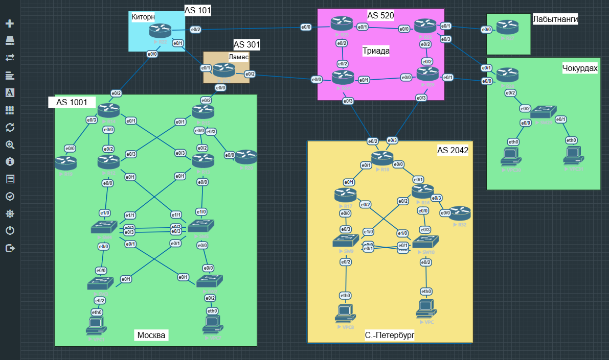

# Лабораторная работа № 1. Проектирование сети

Документация подготовлена по экспорту лаборатории `NEP.unl`. В каталоге `configs` размещены все 31 конфигурация из этого экспорта.

## Цель

Спроектировать адресное пространство IPv4, назначить адреса активным L3-интерфейсам,
выделить VLAN для рабочих станций и управления, предотвратить петли на L2
и подготовить стенд к дальнейшей настройке маршрутизации.

## Топология

Стенд развёрнут в EVE-NG.



| Площадка | Устройства |
| --- | --- |
| Москва, AS 1001 | R12, R13, R14, R15, R19, R20; SW2, SW3, SW4, SW5; VPC1, VPC7 |
| Санкт-Петербург, AS 2042 | R16, R17, R18, R32; SW9, SW10; VPC8, VPC |
| Киторн, AS 101 | R22 |
| Ламас, AS 301 | R21 |
| Триада, AS 520 | R23, R24, R25, R26 |
| Лабытнанги | R27 |
| Чокурдах | R28, SW29, VPC30, VPC31 |

## 1. Адресное пространство

Используются частные диапазоны IPv4. Каждому соединению точка-точка выделена
отдельная подсеть `/30`, каждой офисной VLAN — `/24`, каждому Loopback0 — `/32`.
Одинаковые номера VLAN в разных офисах соответствуют разным IP-подсетям.

| Назначение | Диапазон |
| --- | --- |
| L3-линии Москвы | Подсети /30 из 10.10.0.0/26 |
| L3-линии Санкт-Петербурга | Подсети /30 из 10.20.0.0/27 |
| WAN и соединения провайдеров | Подсети /30 из 10.254.0.0/24 |
| VLAN Москвы | 10.10.10.0/24, 10.10.20.0/24, 10.10.99.0/24 |
| VLAN Санкт-Петербурга | 10.20.10.0/24, 10.20.20.0/24, 10.20.99.0/24 |
| VLAN Чокурдаха | 10.30.10.0/24, 10.30.20.0/24, 10.30.99.0/24 |
| Loopback0 | 10.255.0.<номер устройства>/32 |

Полная таблица содержит 106 назначенных адресов, в том числе оба конца 31 линии /30:
[адресация интерфейсов и VLAN](addressing.md).

## 2. Адреса активных интерфейсов

На маршрутизаторах адреса назначены физическим L3-интерфейсам.
На SW4, SW5, SW9 и SW10 порты к маршрутизаторам переведены в режим
`no switchport`. Эти коммутаторы выполняют функции маршрутизации для офисных сетей.

Пример настройки R14:

```cisco
interface Ethernet0/0
 description TO_R12_E0_2
 ip address 10.10.0.1 255.255.255.252
 no shutdown
```

Полные конфигурации устройств находятся в [configs](configs/README.md).

## 3. VLAN и рабочие станции

В каждом офисе VLAN 10 и 20 разделяют рабочие станции.
VLAN 99 используется для управления, VLAN 1000 — как native VLAN без IP-адреса.
На trunk разрешены VLAN 10, 20, 99 и 1000.

| Офис | VPC | Access-порт | VLAN | IP/префикс | Шлюз |
| --- | --- | --- | --- | --- | --- |
| Москва | VPC1 | SW3 e0/2 | 10 | 10.10.10.10/24 | 10.10.10.2 |
| Москва | VPC7 | SW2 e0/2 | 20 | 10.10.20.10/24 | 10.10.20.3 |
| Санкт-Петербург | VPC8 | SW9 e0/2 | 10 | 10.20.10.10/24 | 10.20.10.1 |
| Санкт-Петербург | VPC | SW10 e0/2 | 20 | 10.20.20.10/24 | 10.20.20.1 |
| Чокурдах | VPC30 | SW29 e0/0 | 10 | 10.30.10.10/24 | 10.30.10.1 |
| Чокурдах | VPC31 | SW29 e0/1 | 20 | 10.30.20.10/24 | 10.30.20.1 |

Шлюзы Москвы размещены на SW4/SW5, Санкт-Петербурга — на SW9/SW10.
В Чокурдахе используется "Роутер на палочке": SW29 e0/2 подключён к R28 e0/2,
а шлюзы находятся на R28 e0/2.10, e0/2.20 и e0/2.99.

## 4. Интерфейсы управления

На маршрутизаторах и L3-коммутаторах создан Loopback0 с уникальным адресом /32.
На всех семи коммутаторах настроен SVI Vlan99.

| Коммутатор | Адрес Vlan99 | Шлюз для L2-коммутатора |
| --- | --- | --- |
| SW2 | 10.10.99.5/24 | 10.10.99.2 |
| SW3 | 10.10.99.4/24 | 10.10.99.2 |
| SW4 | 10.10.99.2/24 | — |
| SW5 | 10.10.99.3/24 | — |
| SW9 | 10.20.99.9/24 | — |
| SW10 | 10.20.99.10/24 | — |
| SW29 | 10.30.99.29/24 | 10.30.99.1 |

## 5. Предотвращение петель и использование параллельных линий

На коммутаторах используется Rapid-PVST. Приоритеты разделяют корневые
коммутаторы по VLAN. На портах к VPC включены PortFast и BPDU Guard.

| Офис | VLAN | Основной корень | Резервный корень |
| --- | --- | --- | --- |
| Москва | 10, 99, 1000 | SW4 | SW5 |
| Москва | 20 | SW5 | SW4 |
| Санкт-Петербург | 10, 99, 1000 | SW9 | SW10 |
| Санкт-Петербург | 20 | SW10 | SW9 |

Параллельные линии объединены протоколом LACP:

| Соединение | Порты на каждой стороне | Логический интерфейс |
| --- | --- | --- |
| SW4 — SW5 | e0/2 и e0/3 | Port-channel1 |
| SW9 — SW10 | e0/0 и e0/1 | Port-channel1 |

STP блокирует избыточные пути в пределах VLAN, а EtherChannel позволяет
использовать оба физических участника агрегата.

[Полная таблица L2-подключений и приоритетов STP](l2-plan.md).

## Файлы лаборатории

- [Все конфигурации устройств](configs/README.md).
- [Исходный экспорт EVE-NG](eve/lab01-eve.zip).
