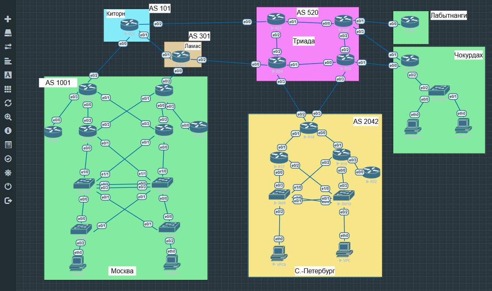

# Лабораторная работа № 2. PBR

## Цель

Настроить политику маршрутизации в офисе Чокурдах и распределить трафик между двумя линками.

## Топология и план работы



1. На R25 и R26 добавить основные и резервные маршруты к Чокурдаху, а также маршруты к Лабытнанги.
2. На R28 настроить IP SLA и track для двух каналов.
3. Распределить трафик VLAN 10 и VLAN 20 с помощью PBR.
4. На R27 настроить маршрут по умолчанию и сохранить конфигурации.

## 1. Распределение трафика на R28

| Источник | Сеть | Основной next-hop | Резервный next-hop |
| --- | --- | --- | --- |
| VPC30, VLAN 10 | 10.30.10.0/24 | R25 — 10.254.0.49 | R26 — 10.254.0.53 |
| VPC31, VLAN 20 | 10.30.20.0/24 | R26 — 10.254.0.53 | R25 — 10.254.0.49 |

ACL CHOK-VLAN10 и CHOK-VLAN20 выбирают соответствующие сети источников.
Основные правила PBR и их привязка к входящим подынтерфейсам:

```
route-map CHOK-PBR permit 10
 match ip address CHOK-VLAN10
 set ip next-hop verify-availability 10.254.0.49 10 track 25
 set ip next-hop verify-availability 10.254.0.53 20 track 26
!
route-map CHOK-PBR permit 20
 match ip address CHOK-VLAN20
 set ip next-hop verify-availability 10.254.0.53 10 track 26
 set ip next-hop verify-availability 10.254.0.49 20 track 25
!
interface Ethernet0/2.10
 ip policy route-map CHOK-PBR
interface Ethernet0/2.20
 ip policy route-map CHOK-PBR
```

Трафик к локальным VLAN и Loopback0 R28 исключён из PBR правилом "deny 5"
с ACL CHOK-LOCAL и направляется по таблице маршрутизации.
При отказе основного канала используется резервный, после восстановления используется основной.

## 2. IP SLA и track

| SLA / track на R28 | Цель | Интерфейс источника |
| --- | --- | --- |
| 25 | Loopback0 R25 — 10.255.0.25 | Ethernet0/1 |
| 26 | Loopback0 R26 — 10.255.0.26 | Ethernet0/0 |

Пример настройки канала через R25:

```
ip route 10.255.0.25 255.255.255.255 Ethernet0/1 10.254.0.49
ip route 10.255.0.25 255.255.255.255 Null0 254
!
ip sla 25
 icmp-echo 10.255.0.25 source-interface Ethernet0/1
 threshold 500
 timeout 1000
 frequency 5
ip sla schedule 25 life forever start-time now
!
track 25 ip sla 25 reachability
 delay down 5 up 10
```

Для R26 используется аналогичная настройка с SLA/track 26.
Интервал — 5 секунд, ожидание ответа — 1 секунда, задержки track — 5 секунд
при отказе и 10 секунд при восстановлении.

## 3. Статические маршруты

На R28 для трафика управления и пакетов вне PBR заданы основной и резервный маршруты:

```cisco
ip route 0.0.0.0 0.0.0.0 Ethernet0/1 10.254.0.49 track 25
ip route 0.0.0.0 0.0.0.0 Ethernet0/0 10.254.0.53 10 track 26
```

На R25 и R26 предусмотрены обратные маршруты к VLAN 10, 20, 99 и Loopback0 R28:

| Устройство | Основной next-hop, AD 1 | Резервный next-hop, AD 10 |
| --- | --- | --- |
| R25 | 10.254.0.50, track 28 | 10.254.0.34, track 29 |
| R26 | 10.254.0.54, track 28 | 10.254.0.33, track 29 |

На каждом устройстве SLA/track 28 отслеживает прямой путь к R28,
SLA/track 29 - путь через соседний маршрутизатор. Также добавлены маршруты
к Loopback0 R27 и необходимые маршруты между сетями этого участка.

В офисе Лабытнанги на R27 настроен маршрут по умолчанию через R25:

```
ip route 0.0.0.0 0.0.0.0 Ethernet0/0 10.254.0.45
```

## Файлы

- [Полные конфигурации устройств](configs/README.md).
- Команды изменений: [R25](changes/R25.txt), [R26](changes/R26.txt), [R27](changes/R27.txt), [R28](changes/R28.txt).
- [Таблица адресации](addressing.md).
